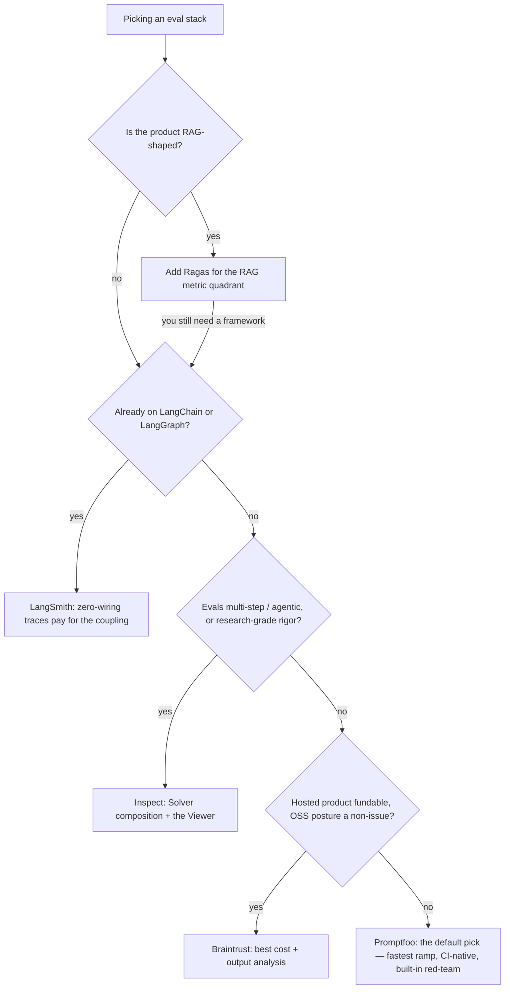

# The comparison

> **Status: draft.** Scores come from the per-tool briefs in [`tools/`](./tools/), which are provisional until the scoring pass (real accounts, real API runs) is complete. The *relative* ordering has been stable since the implementations were built; the absolute numbers may still move by a point on individual axes. Each brief ends with an "open questions before final scoring" list — those are the things that could move a score.

This is the synthesis the rest of the repo exists to back up. If you want to interrogate the numbers, every score links back to a brief, and every brief links back to a working implementation in [`benchmark/`](./benchmark/).

**Want to re-weight instead of read?** The rubric weights below are tuned for mid-size product teams. If your context differs, use the **[interactive comparison](compare/index.html)** — drag the weights, watch the ranking change, and screenshot the result for your own RFC.

---

## The matrix

Scores are 1–5 per axis, methodology in [`methodology/rubric.md`](./methodology/rubric.md). Weighted totals are computed from this table — if you re-derive them and get a different number, file an issue; that's a bug, not an opinion.

| Axis | Weight | Promptfoo | Braintrust | LangSmith | Inspect | Ragas |
|---|---|---|---|---|---|---|
| Developer ergonomics | 0.20 | **5** | 4 | 3 | 3 | 3 |
| CI integration | 0.15 | 4 | 4 | 4 | 4 | 3 |
| Cost transparency | 0.15 | 3 | **5** | 4 | 3 | 2 |
| Multi-model support | 0.15 | **5** | 4 | 4 | **5** | 4 |
| Output analysis | 0.15 | 3 | **5** | **5** | **5** | 1 |
| OSS posture | 0.10 | **5** | 2 | 2 | **5** | **5** |
| Safety / red-team | 0.10 | **5** | 2 | 2 | 4 | 1 |
| **Weighted total** | 1.00 | **4.25** | **3.90** | **3.55** | **4.05** | **2.70** |

Per-axis reasoning lives in each brief: [Promptfoo](./tools/promptfoo.md) · [Braintrust](./tools/braintrust.md) · [LangSmith](./tools/langsmith.md) · [Inspect](./tools/inspect.md) · [Ragas](./tools/ragas.md).

### Reading the ranking

1. **Promptfoo — 4.25.** Wins on the weights this rubric cares about: fastest to a working eval, honest OSS posture, and the only tool with first-class red-teaming. Its weaknesses (no hosted trend analysis, per-run-only cost view) are exactly the things a team can bolt on later; its strengths are the things you can't retrofit.
2. **Inspect — 4.05.** The strongest open-source *framework* in the comparison — best per-sample analysis tool of the five, the right abstraction for multi-step/agentic evals, and zero vendor dependency. It places second only because its ramp is the steepest and the rubric weights ergonomics highest.
3. **Braintrust — 3.90.** Best-in-class on the two axes hosted products should win (cost transparency, output analysis). The gap to the leaders is entirely OSS posture and red-teaming — if those two axes don't matter to your org, read the "re-weight first" section below, because for you Braintrust may genuinely rank first.
4. **LangSmith — 3.55.** The scores say "fine everywhere, exceptional at tracing." The brief says the real value condition is being on LangChain/LangGraph already — that's not an axis in this rubric, and it's the main reason a real team would pick it anyway.
5. **Ragas — 2.70.** The number is structurally misleading and the [brief](./tools/ragas.md) says so loudly: Ragas is a RAG metric *library*, not an eval framework, and most axes don't apply. It's in the comparison because people keep treating it as a framework option. It isn't one — it's a complement (see the pairing advice below).

---

## The recommendation flow

The matrix is context-free; decisions aren't. This is the flow I'd actually walk a team through:

Three pairings worth naming, because the honest answer is often two tools:

- **Ragas + anything.** Ragas is a library; it runs *inside* whichever framework you pick. A RAG-shipping team's realistic stack is `Ragas for the RAG quadrant + one framework for CI, history, and red-team`.
- **Promptfoo in CI + Braintrust for analysis.** Teams that want gating on every PR *and* a place to investigate regressions sometimes run both. It costs you double bookkeeping; it buys you the best of both columns above.
- **Inspect for the hard evals + Promptfoo for the cheap ones.** A pattern from safety-adjacent teams: Inspect where Solver composition earns its overhead, Promptfoo for one-shot regression checks.

---

## If your context is different, re-weight before you argue

The weights encode "mid-size product team, shipping LLM features, first serious eval tool." Different context, different winner — that's a feature of the method, not a flaw. Some worked examples (drag these yourself in the [interactive comparison](compare/index.html)):

- **Regulated industry / safety-critical:** push safety/red-team from 0.10 toward 0.30 and Promptfoo's lead *grows* — it's the only tool with maintained adversarial suites.
- **Hosted-is-fine, analysis-is-everything** (a team with budget whose bottleneck is understanding regressions): push output analysis + cost transparency up and OSS posture to zero, and **Braintrust overtakes Promptfoo**. This is the most common context where the headline ranking gives the wrong answer.
- **Research lab grading capability benchmarks:** ergonomics down (you have champions), multi-model + output analysis up — **Inspect wins comfortably**.
- **OSS-mandate org** (no hosted vendors, period): OSS posture up, and the comparison collapses to Promptfoo vs Inspect — pick on ergonomics (Promptfoo) vs eval complexity (Inspect).

---

## Where the scores disagreed with my gut

The methodology promised this section. Honest entries:

- **The Braintrust/Inspect ordering flipped during arithmetic review.** Early drafts of the briefs had both at 3.95 — re-deriving the totals from the axis scores gives Braintrust 3.90 and Inspect 4.05. My gut had Braintrust ahead (the UI is *immediately* impressive in a way Inspect's decorator stack is not), and I'd written totals that matched the gut, not the table. The table wins; that's what it's for. But it's a real reminder that a 0.15-point gap is inside this method's error bars.
- **LangSmith scores lower than its mindshare suggests.** I expected the most-talked-about tool to land second. The rubric doesn't have an axis for "your team already uses LangChain," which is the actual reason most LangSmith adoptions happen. If that's you, its effective ergonomics score is a 5, not a 3 — and it jumps the queue.
- **Ragas at 2.70 looks like a verdict but isn't.** The rubric measures frameworks; Ragas is deliberately not one. I kept it in the table because TPMs keep being told "just use Ragas" as if it were a framework option — the low score *is* the useful information, as long as the brief's caveat travels with it.
- **Promptfoo's win is partly a weights artifact.** It wins because this rubric prices ergonomics and OSS posture the way a first-tool adoption should. A team on its *second* eval tool — one that knows what analysis it's missing — would reasonably weight output analysis higher, and the race gets much closer.

---

## What would change these numbers

The scoring pass (next milestone in the [README status](./README.md#status)) runs each tool against a real account/API end-to-end. Per the briefs, the scores most likely to move:

- Braintrust **output analysis vs Promptfoo's** — needs the side-by-side on the same eval.
- Promptfoo **cost transparency** — docs hint at workspace rollups that would raise the 3.
- Inspect **developer ergonomics** — a multi-step eval may justify the framework overhead and raise the 3.
- LangSmith **cost transparency** — project-level rollup quality vs Braintrust is unverified.

Corrections welcome — especially from people who ship these tools. Open an issue with the axis, the evidence, and the score you'd give.
